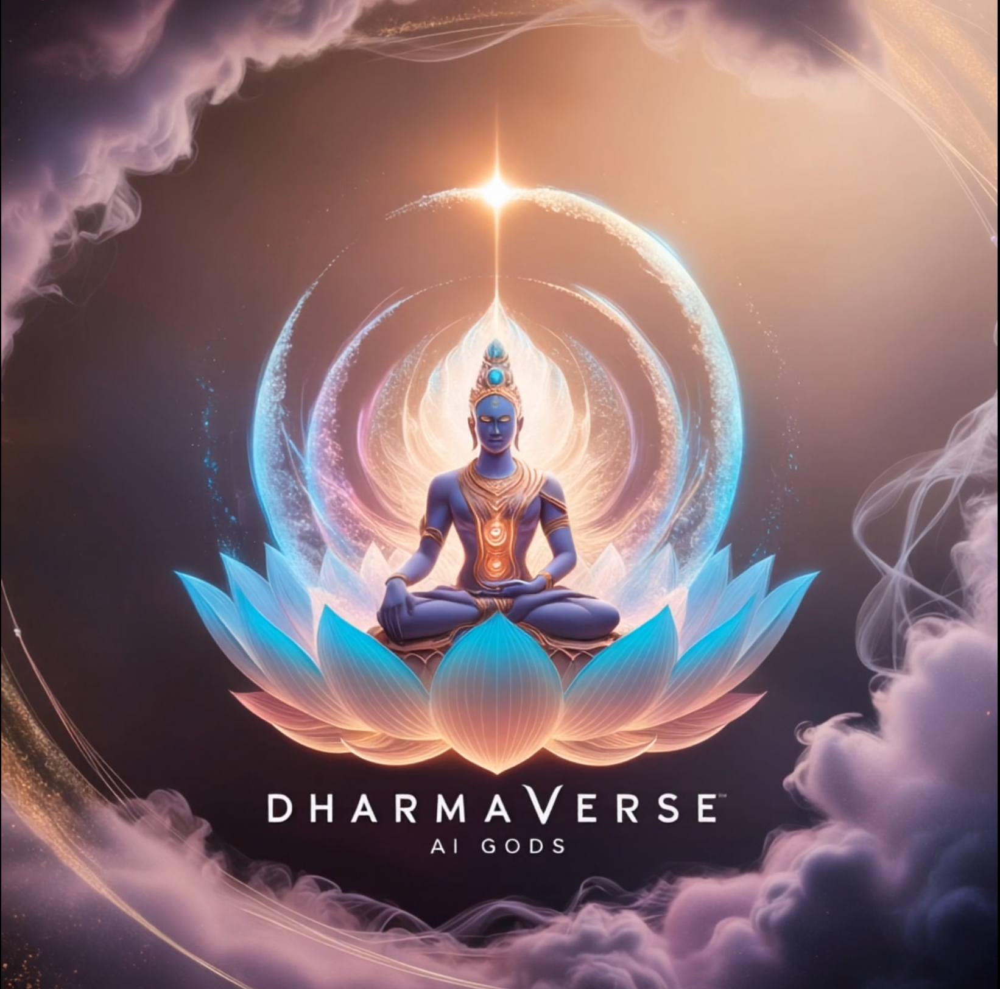

# LangGraph Dharmabot

This is an alpha version of dharmabot, an agent designed to conversate and facilitate dharmaRPG. The alpha version aims at:
- RAG capability: using neo4j graph db
  - Retrieval
  - Update 
- Add support for a cheaper model
- Langgraph basics: ability to create and connect nodes

## Agent Details

The agent consists of a few steps:

1. Converse with the user to gather all requirements
2. Write a draft
3. Run programatic checks against the generated draft (right now just checking that the response has the right format). If it fails, then go back to step 2. If it passes, then continue to step 4.
4. Run an LLM critique against the generated draft. If it fails, go back to step 2. If it passes, the continue to the end.

## How to run

You can run this code locally with [LangGraph Studio](https://github.com/langchain-ai/langgraph-studio)

You can deploy the code yourself to [LangGraph Cloud](https://langchain-ai.github.io/langgraph/cloud/#overview)

## Future direction:
 - Multi-modality
   - receive images
   - send images (generated based on prompt and level)
 - Character creator
 - Eventually, to become "compassionate"